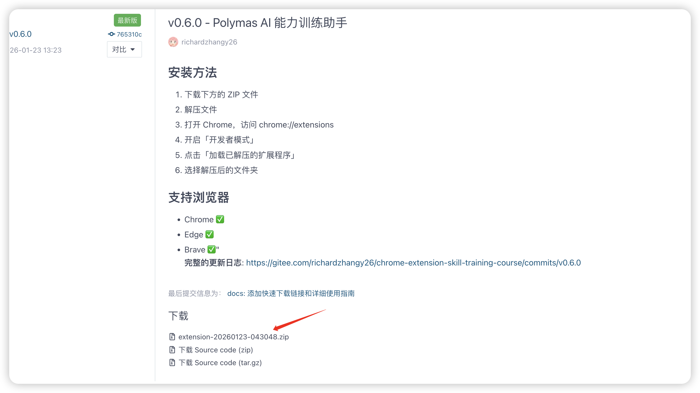
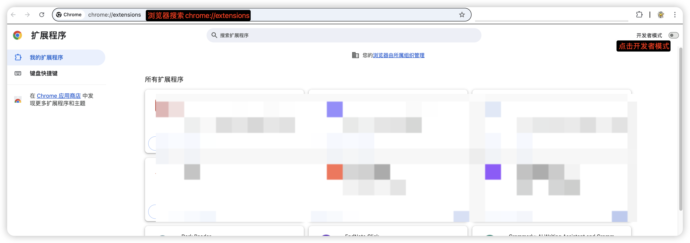
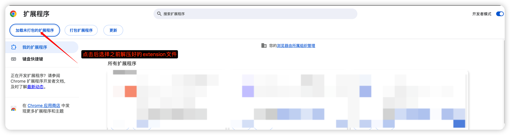
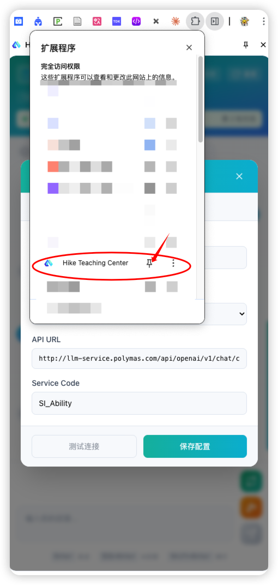
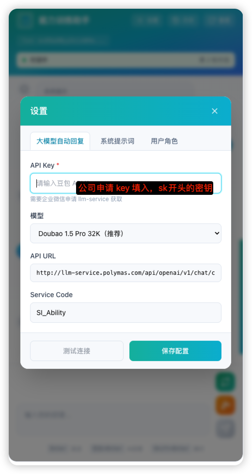
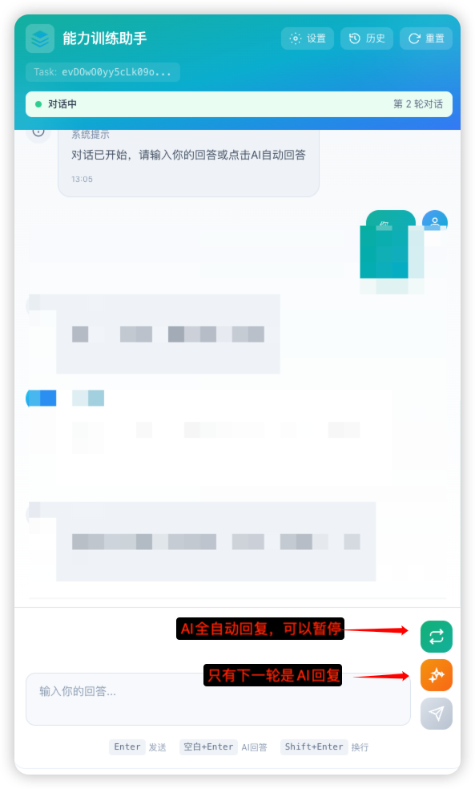
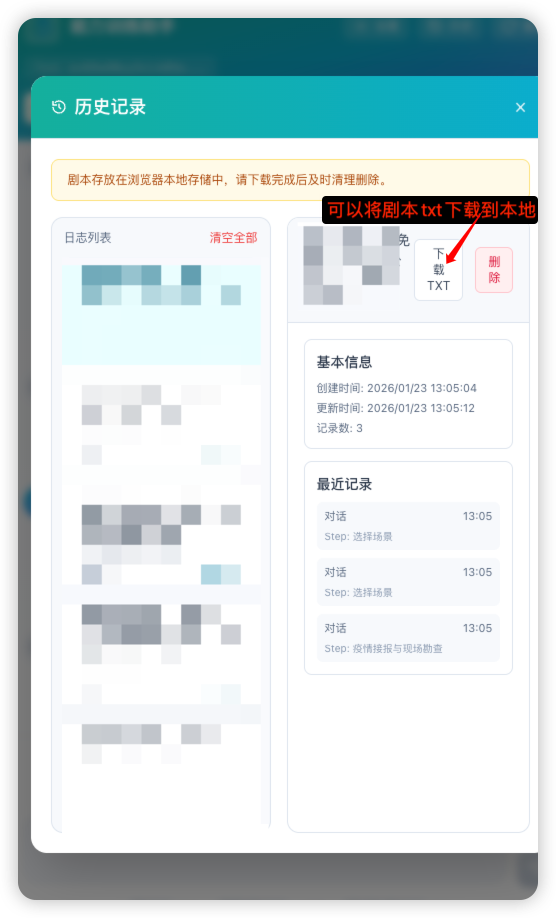
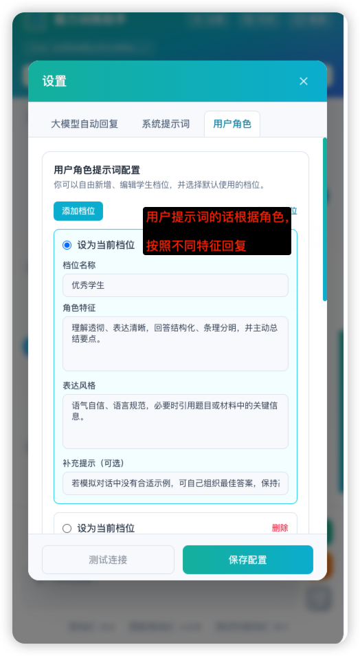
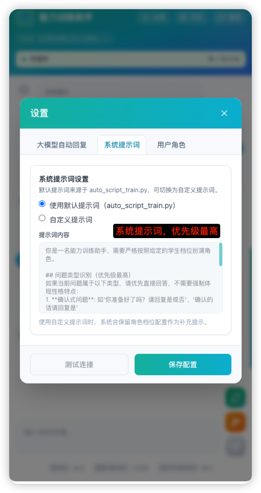
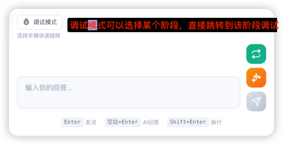

# Polymas AI 训练助手 - Chrome 扩展

基于 React 19 + TypeScript + Vite 6 构建的浏览器扩展，用于 Polymas 教学平台的 AI 能力训练。

## 🚀 快速下载

**👉 [点击下载最新版本 v0.7.0](https://gitee.com/richardzhangy26/chrome-extension-skill-training-course/releases/tag/v0.7.0)**

下载 ZIP 文件后，按照下方安装步骤操作即可使用。

---

## 目录

- [安装使用](#安装使用)
- [使用指南](#使用指南)
- [开发指南](#开发指南)
- [项目结构](#项目结构)
- [常见问题](#常见问题)

---

## 安装使用

### 支持的浏览器

| 浏览器 | 支持情况 | 说明 |
|--------|---------|------|
| Chrome | ✅ 完全支持 | 推荐使用 |
| Edge | ✅ 兼容 | 基于 Chromium |
| Brave | ✅ 兼容 | 基于 Chromium |
| Firefox | ✅ 支持 | 需单独构建 |

### Chrome / Edge / Brave 安装步骤

1. [下载 ZIP 文件](https://gitee.com/richardzhangy26/chrome-extension-skill-training-course/releases/tag/v0.7.0)


2. 解压 ZIP 文件到任意文件夹
3. 打开浏览器扩展页面：
   - Chrome: 地址栏输入 `chrome://extensions`
   - Edge: 地址栏输入 `edge://extensions`
   - Brave: 地址栏输入 `brave://extensions`
4. 开启右上角的 **开发者模式**
5. 点击 **加载已解压的扩展程序**

6. 选择解压后的文件夹

7. 安装成功后，工具栏会出现扩展图标


### Firefox 安装步骤

1. 获取 Firefox 版本的扩展文件
2. 打开 `about:debugging#/runtime/this-firefox`
3. 点击 **临时载入附加组件**
4. 选择文件夹中的 `manifest.json`

> ⚠️ **注意**：Firefox 临时加载的扩展会在浏览器关闭后消失，需要每次启动浏览器时重新加载。

---

## 使用指南

### 第一步：配置 LLM（必须）

1. 点击扩展图标，打开侧边栏
2. 点击右上角的 **⚙️ 设置** 按钮
3. 在「LLM 配置」标签页中填写：
   - **API Key**：你的API密钥(需要去企业微信llm-service上申请)
   - **模型**：选择要使用的模型（推荐 Doubao Pro 32K）
   - **Endpoint ID**：你的端点 ID
   - **服务代码**：服务代码（可选）
4. 点击「测试连接」确认配置正确
5. 点击「保存配置」


### 第二步：开始训练

1. 访问 Polymas 教学平台的训练页面（URL 中需包含 `trainTaskId` 参数）
2. 打开扩展侧边栏
3. 扩展会自动识别训练任务 ID
4. 点击 **「开始训练」** 按钮
5. 系统会自动获取训练步骤并开始对话

### 第三步：对话交互

训练开始后，你可以：

| 操作 | 说明 |
|------|------|
| **手动输入** | 在输入框中输入回复，点击发送 |
| **AI 自动生成** | 点击 ✨ 按钮，AI 根据学生档位自动生成回复 |
| **连续自动对话** | 点击 🔄 按钮，开启自动对话模式 |
| **调试模式** | 点击 **调试模式** 按钮，开启调试模式 |



### 第四步：查看历史记录

1. 点击侧边栏右上角的 **📜 历史** 按钮
2. 左侧列表显示所有训练会话，按时间倒序排列
3. 点击任意会话可查看详情
4. 支持的操作：
   - **编辑名称**：点击「编辑名称」按钮，可自定义会话名称（支持 Enter 保存，Escape 取消）
   - **下载 TXT**：将对话记录导出为文本文件
   - **删除**：删除单条记录
   - **清空全部**：清空所有历史记录

> ⚠️ **注意**：历史记录存储在浏览器本地，清除浏览器数据会导致记录丢失，请及时下载备份。



## 高级功能（可选）

### 自定义学生档位（可选）

1. 打开设置 → 「用户角色」标签页
2. 可以选择预设的学生档位：
   - **优秀学生**：理解透彻、表达清晰
   - **需要引导的学生**：基本理解但不够全面
   - **答非所问的学生**：理解偏差、容易跑题
3. 也可以点击「添加档位」创建自定义角色
4. 编辑档位的名称、角色特征、表达风格
5. 点击「保存配置」




### 自定义系统提示词（可选）

1. 打开设置 → 「系统提示词」标签页
2. 选择「自定义模式」
3. 编辑系统提示词内容
4. 点击「保存配置」



### 调试模式（可选）

1. 点击调试模式按钮
2. 选择或者搜索想要跳转的步骤



---

## 开发指南(非开发人员请忽略)

### 环境要求

- **Node.js**: >= 22.15.1（查看 `.nvmrc`）
- **包管理器**: pnpm 10.11.0+
- **Windows 用户**: 必须在 WSL 环境下运行

### 安装依赖

```bash
# 全局安装 pnpm（如果没有）
npm install -g pnpm

# 安装项目依赖
pnpm install
```

### 开发命令

```bash
# 启动开发服务器（支持热更新）
pnpm dev              # Chrome 版本
pnpm dev:firefox      # Firefox 版本

# 生产构建
pnpm build            # Chrome 版本
pnpm build:firefox    # Firefox 版本

# 打包 ZIP
pnpm zip              # Chrome 版本
pnpm zip:firefox      # Firefox 版本
```

### 代码检查

```bash
pnpm type-check       # TypeScript 类型检查
pnpm lint             # ESLint 检查
pnpm lint:fix         # 自动修复 ESLint 问题
pnpm format           # Prettier 格式化
```

### 添加依赖

```bash
# 在根目录添加依赖
pnpm i <package> -w

# 为特定模块添加依赖（如 side-panel）
pnpm i <package> -F side-panel
```

### 清理项目

```bash
pnpm clean            # 清理 dist、node_modules、turbo 缓存
pnpm clean:install    # 清理后重新安装
```

---

## 项目结构

```
├── chrome-extension/     # 扩展配置
│   ├── manifest.ts       # 生成 manifest.json（修改这里，不要直接改 manifest.json）
│   ├── src/background/   # 后台服务脚本
│   └── public/           # 图标等静态资源
│
├── pages/                # 扩展页面（每个是独立入口）
│   ├── side-panel/       # 侧边栏（主要聊天界面）
│   ├── popup/            # 工具栏弹窗
│   ├── options/          # 设置页面
│   ├── content/          # 注入页面的脚本
│   └── content-ui/       # 注入页面的 React 组件
│
└── packages/             # 共享库
    ├── storage/          # Chrome 存储封装
    ├── shared/           # 共享类型、常量、工具函数
    ├── ui/               # 可复用 React 组件
    └── i18n/             # 国际化
```

### 关键文件说明

| 文件/目录 | 说明 |
|-----------|------|
| `chrome-extension/manifest.ts` | 扩展清单配置，**不要直接编辑 manifest.json** |
| `pages/side-panel/` | 主要的 AI 聊天界面 |
| `chrome-extension/src/background/` | 后台服务，处理认证和 API 请求 |
| `packages/storage/lib/impl/` | 存储模块，新模块需在 `index.ts` 中导出 |

---

## 常见问题

### 热更新卡住了

1. 按 `Ctrl+C` 停止开发服务器，然后重新运行 `pnpm dev`
2. 如果遇到 `grpc` 错误，先杀掉 `turbo` 进程再重新运行

### 导入路径报错

使用 `@extension/` 前缀导入共享包，例如：
```typescript
import { someUtil } from '@extension/shared';
import { storage } from '@extension/storage';
```

### Windows 下运行失败

必须在 WSL 环境下运行，并且 `pnpm dev` 需要以管理员身份运行。

### 调试方法

| 组件 | 调试方式 |
|------|----------|
| 侧边栏 | 右键侧边栏 → 检查 |
| 后台脚本 | `chrome://extensions` → 点击扩展的 "service worker" |
| 内容脚本 | 打开页面的开发者工具 → 控制台 |
| 弹窗 | 右键扩展图标 → 检查弹出内容 |

---

## 版本更新

```bash
pnpm update-version <version>    # 更新扩展版本号
```

---

## 参考资料

- [Chrome Extensions 文档](https://developer.chrome.com/docs/extensions)
- [Vite 文档](https://vitejs.dev/)
- [Turborepo 文档](https://turbo.build/repo/docs)

---

## 更新日志 (Changelog)

### v0.7.0 (最新版)

#### 新功能
- **历史记录清空确认弹窗**：点击"清空全部"时弹出美观的确认对话框，防止误操作
- **对话详情预览**：在历史记录的"最近记录"中点击对话项可展开查看用户消息和 AI 回复内容
- **按钮悬停提示优化**：右侧三个操作按钮添加了美观的 Tooltip 提示（发送消息 / AI 回复下一轮 / AI 全自动回复）

#### 优化
- **调试模式布局调整**：将"选择步骤快速跳转"提示移至调试模式按钮下方，布局更清晰

### v0.6.0

#### 新功能
- **模型列表扩展**：新增 GPT-4o、GPT-4o-mini、Gemini 2.5 Flash、Claude 3.5 Haiku、Grok 4 等主流模型支持
- **会话名称编辑**：历史记录中可直接编辑会话名称，支持键盘快捷键（Enter 保存，Escape 取消）
- **训练任务缓存**：支持从浏览器存储恢复训练任务 ID，刷新页面后无需重新识别

#### 优化
- **首步骤识别逻辑重构**：基于 `SCRIPT_START` 节点类型匹配 flowList，优先匹配 `isDefault=1` 的流程
- **会话命名优化**：自动包含学生档位标签，便于识别不同配置的训练记录
- **新标签页行为**：移除新标签页覆盖配置，不再影响用户默认新标签页

### v0.5.0

- 重构学生档位为动态数组，支持自定义编辑
- 添加 LLM 配置功能
- 优化 side-panel UI 配色
- 添加连续对话功能
- 集成 AI 智能体聊天系统与 Polymas 教学平台
