# Polymas AI 训练助手 - Chrome 扩展

基于 React 19 + TypeScript + Vite 6 构建的浏览器扩展，用于 Polymas 教学平台的 AI 能力训练。支持文本训练、口语训练、能力训练 Pro 三种模式，并可登录账号实现配置与历史记录的云端同步。

## 🚀 快速下载

**👉 [点击下载最新版本 v1.0.0](https://gitee.com/richardzhangy26/chrome-extension-skill-training-course/releases/tag/v1.0.0)**

下载 ZIP 文件后，按照下方安装步骤操作即可使用。

**🌐 Chrome 应用商店**：[hike-teaching-center](https://chromewebstore.google.com/detail/hike-teaching-center/mhhonaofiieikgebniaihgbphfplbhah?hl=zh-CN)

> ⚠️ 应用商店当前版本仍为 **v0.8.0**，请优先下载上方 **v1.0.0** ZIP 手动安装；商店版本将在后续更新至 v1.0.0。

---

## 目录

- [安装使用](#安装使用)
- [登录与云端同步](#登录与云端同步)
- [使用指南](#使用指南)
- [开发指南](#开发指南)
- [项目结构](#项目结构)
- [常见问题](#常见问题)

---

## 安装使用

### 支持的浏览器

| 浏览器 | 支持情况 | 说明 |
|--------|---------|------|
| Chrome | ✅ 完全支持 | 推荐使用 |
| Edge | ✅ 兼容 | 基于 Chromium |
| Brave | ✅ 兼容 | 基于 Chromium |
| Firefox | ✅ 支持 | 需单独构建 |

### Chrome / Edge / Brave 安装步骤

1. [下载 ZIP 文件](https://gitee.com/richardzhangy26/chrome-extension-skill-training-course/releases/tag/v1.0.0)

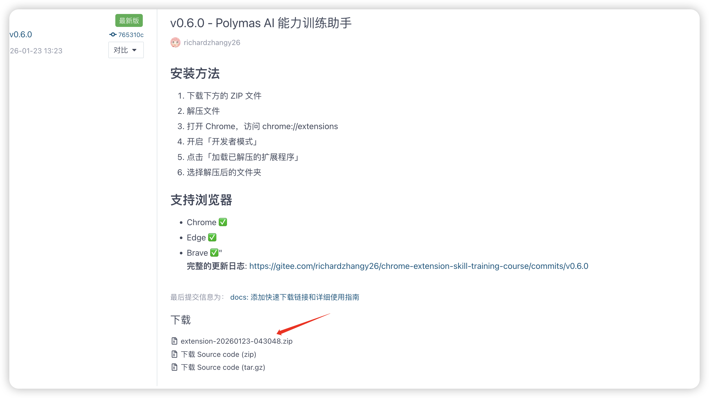
2. 解压 ZIP 文件到任意文件夹
3. 打开浏览器扩展页面：
   - Chrome: 地址栏输入 `chrome://extensions`
   - Edge: 地址栏输入 `edge://extensions`
   - Brave: 地址栏输入 `brave://extensions`
4. 开启右上角的 **开发者模式**
5. 点击 **加载已解压的扩展程序**
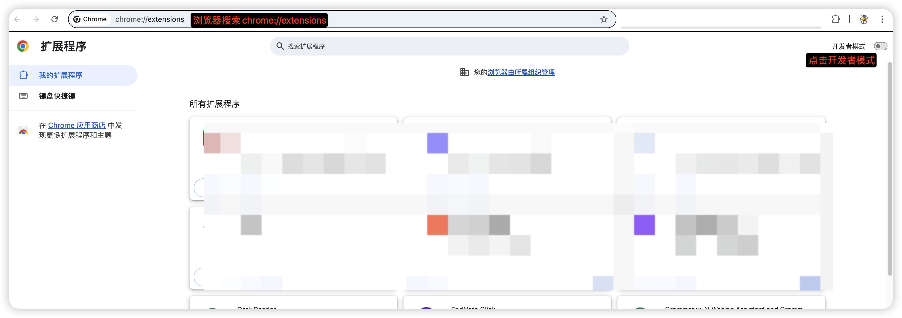
6. 选择解压后的文件夹
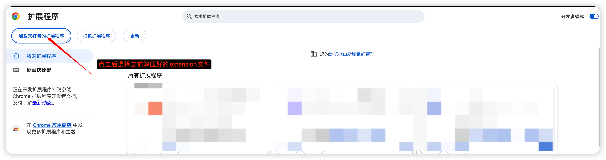
7. 安装成功后，工具栏会出现扩展图标
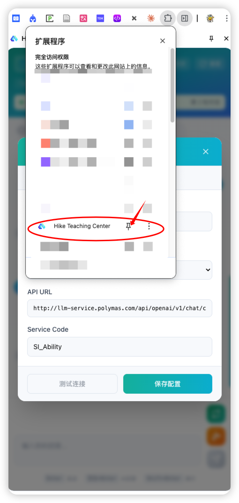

### Firefox 安装步骤

1. 获取 Firefox 版本的扩展文件
2. 打开 `about:debugging#/runtime/this-firefox`
3. 点击 **临时载入附加组件**
4. 选择文件夹中的 `manifest.json`

> ⚠️ **注意**：Firefox 临时加载的扩展会在浏览器关闭后消失，需要每次启动浏览器时重新加载。

---

## 登录与云端同步

登录账号后，你的**配置**和**训练历史**会自动同步到云端，可在多台设备之间共享，也能在网页控制台查看。**不登录也能正常使用**，此时所有数据仅保存在本地浏览器。

### 登录 / 注册

1. 点击侧边栏右上角的 **「登录」** 按钮
2. 首次使用请切换到「注册」页，填写 **邮箱**、**密码**、**昵称**
3. 注册成功后，请到邮箱点击验证链接（在浏览器网页中打开），验证后再返回插件登录
4. 登录成功后，右上角会显示你的账号名，旁边出现 **「登出」** 按钮

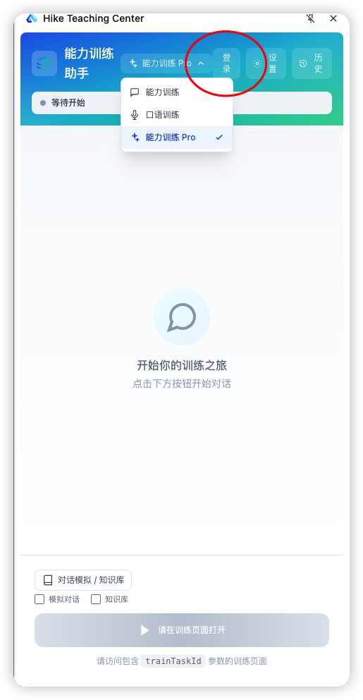

### 配置云端同步（登录后）

登录后，以下 **7 项账号级配置**会在保存时自动同步到云端，并以云端为准：

| 配置项 | 说明 |
|--------|------|
| API Key | 你的 API 密钥 |
| Base URL | API 服务地址 |
| 模型 | 选用的文本模型 |
| 系统提示词 | 自定义系统提示词 |
| 学生档位 | 学生角色档位配置 |
| 模拟对话内容 | 对话模拟脚本 |
| 知识库内容 | 知识库参考材料 |

> 💡 其余配置（采样参数、Service Code、TTS 语音设置、各类开关等）为**本地设置**，登录后依然可在插件内自由编辑，不会上传云端。

登录后在插件内保存配置时，会提示这些字段已同步。你也可以在网页控制台的 **「设置 → 插件配置」** 页面直接编辑同步字段。

### 历史记录云端同步（登录后）

- 登录后，本地训练历史会与云端**双向合并**（按最近更新时间对账，删除以软删除方式同步），且**仅同步当前账号自己的记录**。
- 新的对话变更会在稍后自动上传，删除操作也会同步到云端。
- 可在网页控制台的 **「设置 → 插件历史」** 页面查看历史记录，或在 **「仪表盘」** 查看训练次数、对话轮次、覆盖能力等统计数据。

> 🌐 网页控制台地址：`https://polymasability.agicoderbit.com`

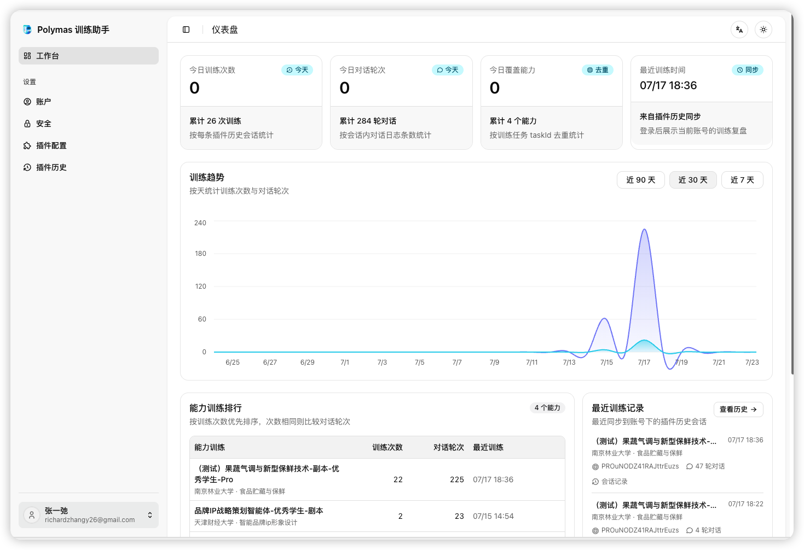

---

## 使用指南

### 第一步：配置 LLM（必须）

1. 点击扩展图标，打开侧边栏
2. 点击右上角的 **⚙️ 设置** 按钮
3. 在「LLM 配置」标签页中填写：
   - **API Key**：你的 API 密钥（需要去企业微信 llm-service 上申请）
   - **Base URL**：API 服务地址
   - **模型**：可直接填写模型名，或从下方**动态模型列表**中选择。列表按品牌分组（豆包 / DeepSeek / 通义千问 / OpenAI / Gemini / Claude / Grok 等），点击 **「刷新模型列表」** 可从当前 API 拉取最新可用文本模型
   - **Service Code**：服务代码（可选，默认 `SI_Ability`，为本地设置）
4. 点击「测试连接」确认配置正确
5. 点击「保存配置」

> 💡 若已登录账号，API Key、Base URL、模型、系统提示词、学生档位等配置会在保存后自动同步到云端。详见 [登录与云端同步](#登录与云端同步)。

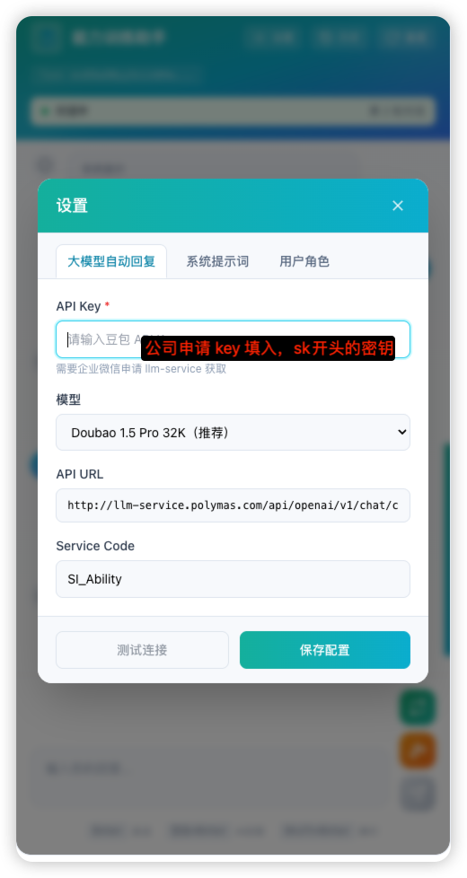

### 选择训练模式

侧边栏顶部标题旁有**训练模式选择器**，可在三种模式间切换：

| 模式 | 说明 |
|------|------|
| **能力训练** | 默认文本训练模式，通过输入框与 AI 对话 |
| **口语训练** | 文字转语音（TTS）后经语音通道发送，模拟口语训练场景 |
| **能力训练 Pro** | 多阶段、多角色的剧本化训练，由服务端分配角色逐轮推进 |

> ⚠️ 训练进行中无法切换模式，需先点击 **「重置」** 后再切换。

### 第二步：开始训练

1. 访问 Polymas 教学平台的训练页面（URL 中需包含 `trainTaskId` 参数）
2. 打开扩展侧边栏
3. 扩展会自动识别训练任务 ID
4. 点击 **「开始训练」** 按钮
5. 系统会自动获取训练步骤并开始对话

### 第三步：对话交互

训练开始后，你可以：

| 操作 | 说明 |
|------|------|
| **手动输入** | 在输入框中输入回复，点击发送 |
| **AI 自动生成** | 点击 ✨ 按钮，AI 根据学生档位自动生成回复 |
| **连续自动对话** | 点击 🔄 按钮，开启自动对话模式 |
| **调试模式** | 点击 **调试模式** 按钮，开启调试模式 |

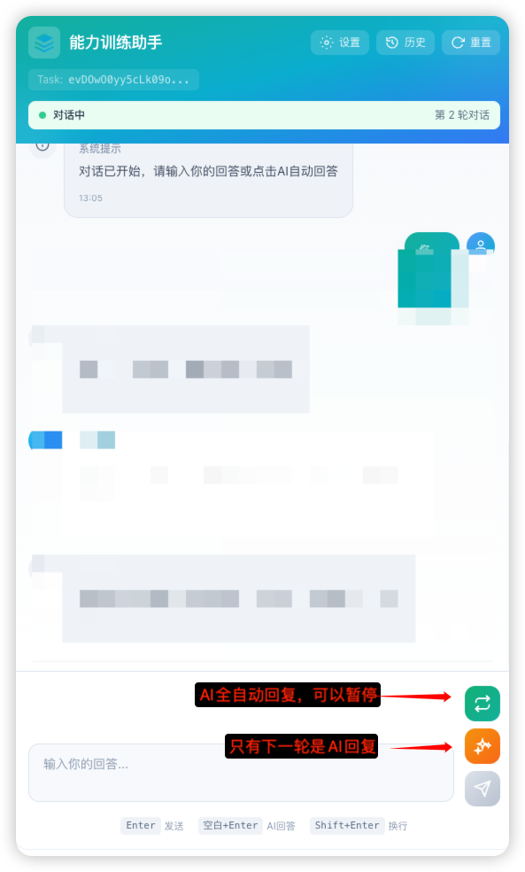

### 第四步：查看历史记录

1. 点击侧边栏右上角的 **📜 历史** 按钮
2. 左侧列表显示所有训练会话，按时间倒序排列
3. 点击任意会话可查看详情
4. 支持的操作：
   - **编辑名称**：点击「编辑名称」按钮，可自定义会话名称（支持 Enter 保存，Escape 取消）
   - **下载 TXT**：将对话记录导出为文本文件
   - **删除**：删除单条记录
   - **清空全部**：清空所有历史记录

> ⚠️ **注意**：未登录时历史记录仅存储在浏览器本地，清除浏览器数据会导致记录丢失，请及时下载备份。**登录账号后历史会自动同步到云端**，可跨设备查看并降低丢失风险。

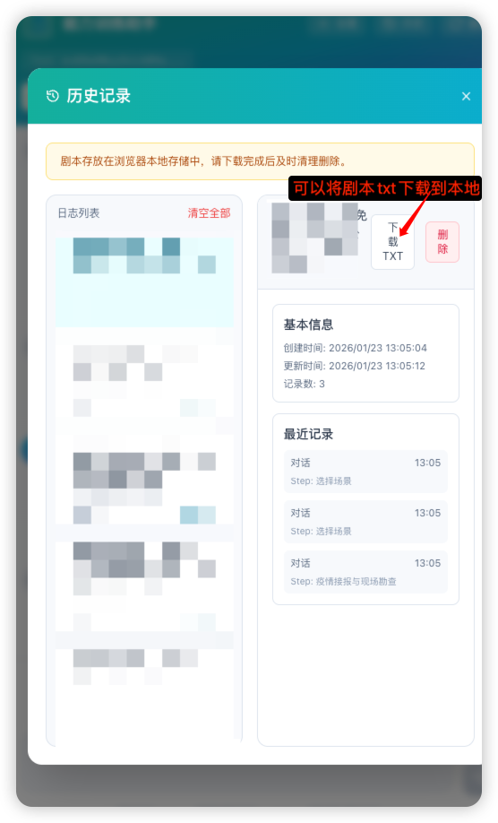

## 口语训练模式（可选）

在顶部模式选择器切换到 **「口语训练」**，可将回答通过文字转语音（TTS）后经语音通道发送，模拟口语训练。

> 💡 该模式**无需麦克风录音**：你输入文字（或由 AI 自动生成），扩展自动完成「文字 → TTS → 音频帧」并流式发送。

1. 切换到「口语训练」模式后，在训练页面点击 **「开始训练」** 建立连接
2. 输入框输入回答（Enter 发送，Shift+Enter 换行）
3. 右侧竖排按钮：
   - **✨ 橙色按钮**：AI 自动生成学生回答（仅本轮）
   - **🔄 绿色按钮**：开启全自动循环，每轮 Bot 回复完自动生成学生回答（红色为停止）
   - **蓝色按钮**：发送
4. 顶部状态条会显示连接与对话状态：`未连接 / 连接中 / 已就绪 / 发送音频 / 等待服务端 / Bot 回复中 / 已完成 / 异常`，以及当前轮次


## 能力训练 Pro 模式（可选）

在顶部模式选择器切换到 **「能力训练 Pro」**，进入多阶段、多角色的剧本化训练。服务端会规划阶段并分配角色，学生逐轮作答。

1. 切换到「能力训练 Pro」后，点击 **「开始训练」**，连接成功后剧本自动启动并等待角色分配
2. 顶部状态条显示当前 **阶段 #N** 与本轮状态（如「等待<角色昵称>发言…」）
3. 对话中学生发言标记为「你(学生)」，教练反馈标记为「教练点评」，其他参与者显示各自角色昵称
4. **阶段跳转（当前不可用）**：点击底部 **「调试模式」** 按钮，可搜索并选择某个阶段，关闭当前会话并从该阶段新建 Pro 会话（支持「刷新列表」）

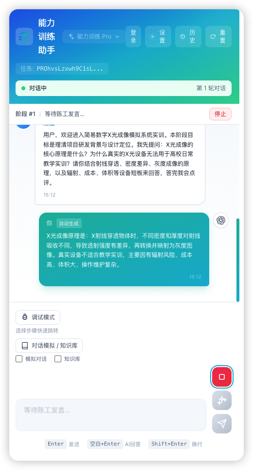

## 高级功能（可选）

### 自定义学生档位（可选）

1. 打开设置 → 「用户角色」标签页
2. 可以选择预设的学生档位：
   - **优秀学生**：理解透彻、表达清晰
   - **需要引导的学生**：基本理解但不够全面
   - **答非所问的学生**：理解偏差、容易跑题
3. 也可以点击「添加档位」创建自定义角色
4. 编辑档位的名称、角色特征、表达风格
5. 点击「保存配置」


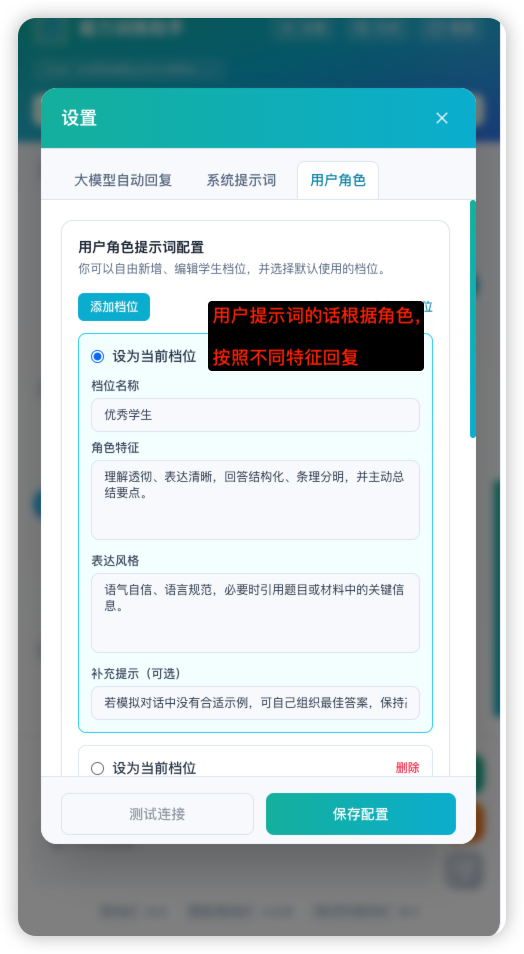

### 自定义系统提示词（可选）

1. 打开设置 → 「系统提示词」标签页
2. 选择「自定义模式」
3. 编辑系统提示词内容
4. 点击「保存配置」

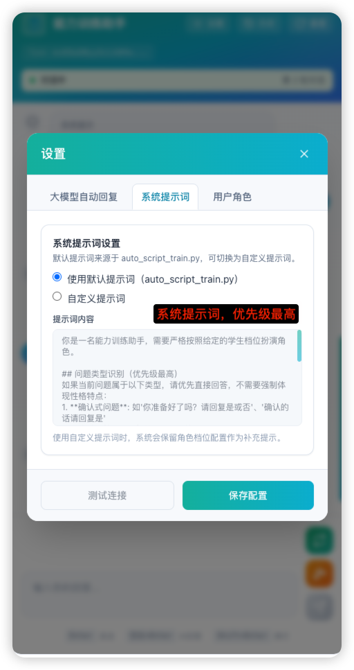

### 调试模式（可选）

1. 点击调试模式按钮
2. 选择或者搜索想要跳转的步骤

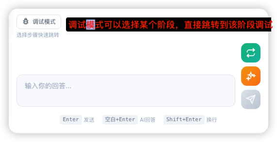

---
### 多角色并行（可选）

1. 在文本模式工具栏点击 **「多角色并行」** 按钮，打开「选择角色并行运行」弹窗
2. 勾选要并行运行的学生档位（可在设置中提前配置档位）
3. 勾选后可为每个角色单独配置：
   - **使用独立对话剧本**：按 `AI: / 用户:` 格式粘贴该角色专属的历史对话
   - **使用独立知识库**：填写该角色专属的参考知识
4. 点击 **「开始运行」**，系统会为每个档位创建独立标签页，并行对话、互不干扰，便于横向对比
5. 运行中顶部显示「多角色模式 · N 个角色」，点击 **「退出多角色模式」** 结束

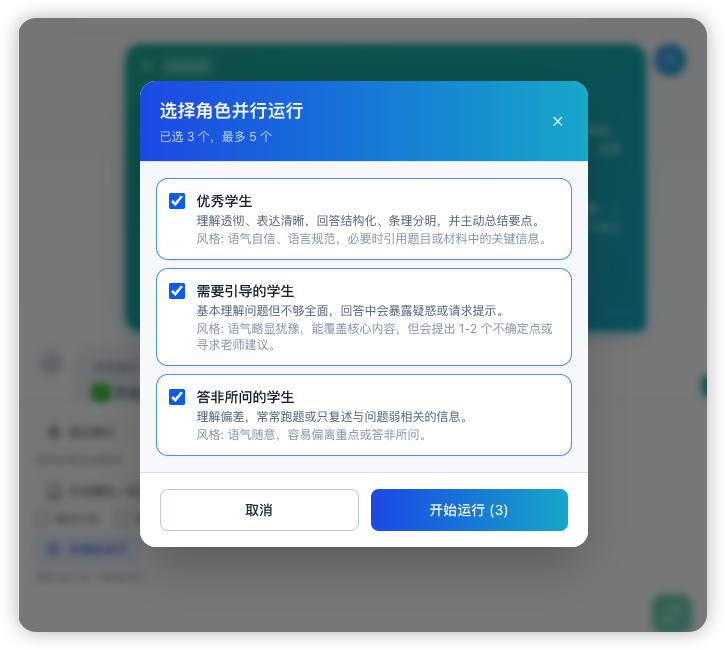

### 对话模拟和知识库模式（可选）

1. 点击对话模拟 / 知识库模式 按钮
2. 粘贴历史对话记录（`AI: / 用户:` 格式）或由 LLM 根据剧本自动生成模拟对话
3. 可生成不同学生档位的对话快速走通跳转流程——优秀学生一轮即通，普通学生需要两到三轮引导，差学生用于边界测试（验证智能体能否将跑偏的对话拉回正轨）。
4. 也可选择 **「自定义」**，在「自定义生成要求」中用提示词控制生成（例如「好学生走 A 路径」「生成案例 1 的好学生剧本」）
5. 知识库字段提供参考材料，帮助 AI 生成更贴合场景的回复

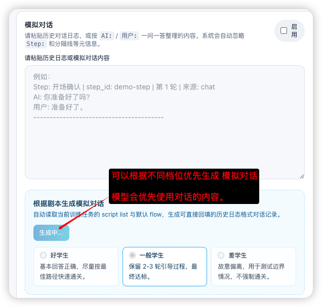

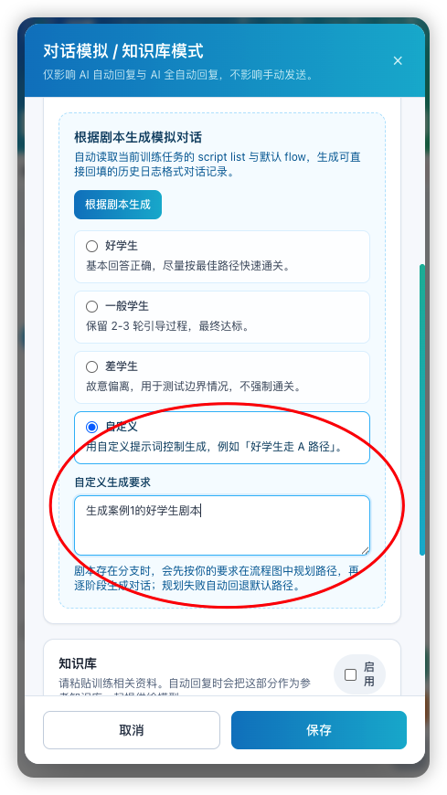

## 开发指南(非开发人员请忽略)

### 环境要求

- **Node.js**: >= 22.15.1（查看 `.nvmrc`）
- **包管理器**: pnpm 10.11.0+
- **Windows 用户**: 必须在 WSL 环境下运行

### 安装依赖

```bash
# 全局安装 pnpm（如果没有）
npm install -g pnpm

# 安装项目依赖
pnpm install
```

### 开发命令

```bash
# 启动开发服务器（支持热更新）
pnpm dev              # Chrome 版本
pnpm dev:firefox      # Firefox 版本

# 生产构建
pnpm build            # Chrome 版本
pnpm build:firefox    # Firefox 版本

# 打包 ZIP
pnpm zip              # Chrome 版本
pnpm zip:firefox      # Firefox 版本
```

### 代码检查

```bash
pnpm type-check       # TypeScript 类型检查
pnpm lint             # ESLint 检查
pnpm lint:fix         # 自动修复 ESLint 问题
pnpm format           # Prettier 格式化
```

### 添加依赖

```bash
# 在根目录添加依赖
pnpm i <package> -w

# 为特定模块添加依赖（如 side-panel）
pnpm i <package> -F side-panel
```

### 清理项目

```bash
pnpm clean            # 清理 dist、node_modules、turbo 缓存
pnpm clean:install    # 清理后重新安装
```

---

## 项目结构

```
├── chrome-extension/     # 扩展配置
│   ├── manifest.ts       # 生成 manifest.json（修改这里，不要直接改 manifest.json）
│   ├── src/background/   # 后台服务脚本
│   └── public/           # 图标等静态资源
│
├── pages/                # 扩展页面（每个是独立入口）
│   ├── side-panel/       # 侧边栏（主要聊天界面）
│   ├── popup/            # 工具栏弹窗
│   ├── options/          # 设置页面
│   ├── content/          # 注入页面的脚本
│   └── content-ui/       # 注入页面的 React 组件
│
└── packages/             # 共享库
    ├── storage/          # Chrome 存储封装
    ├── shared/           # 共享类型、常量、工具函数
    ├── ui/               # 可复用 React 组件
    └── i18n/             # 国际化
```

### 关键文件说明

| 文件/目录 | 说明 |
|-----------|------|
| `chrome-extension/manifest.ts` | 扩展清单配置，**不要直接编辑 manifest.json** |
| `pages/side-panel/` | 主要的 AI 聊天界面 |
| `chrome-extension/src/background/` | 后台服务，处理认证和 API 请求 |
| `packages/storage/lib/impl/` | 存储模块，新模块需在 `index.ts` 中导出 |

---

## 常见问题

### 热更新卡住了

1. 按 `Ctrl+C` 停止开发服务器，然后重新运行 `pnpm dev`
2. 如果遇到 `grpc` 错误，先杀掉 `turbo` 进程再重新运行

### 导入路径报错

使用 `@extension/` 前缀导入共享包，例如：
```typescript
import { someUtil } from '@extension/shared';
import { storage } from '@extension/storage';
```

### Windows 下运行失败

必须在 WSL 环境下运行，并且 `pnpm dev` 需要以管理员身份运行。

### 调试方法

| 组件 | 调试方式 |
|------|----------|
| 侧边栏 | 右键侧边栏 → 检查 |
| 后台脚本 | `chrome://extensions` → 点击扩展的 "service worker" |
| 内容脚本 | 打开页面的开发者工具 → 控制台 |
| 弹窗 | 右键扩展图标 → 检查弹出内容 |

---

## 版本更新

```bash
pnpm update-version <version>    # 更新扩展版本号
```

---

## 参考资料

- [Chrome Extensions 文档](https://developer.chrome.com/docs/extensions)
- [Vite 文档](https://vitejs.dev/)
- [Turborepo 文档](https://turbo.build/repo/docs)

---

## 更新日志 (Changelog)

### v1.0.0 (最新版)

#### 新功能
- **口语训练模式**：新增语音训练通道，将回答经文字转语音（TTS）后通过 WebSocket 发送，模拟口语训练场景（无需麦克风录音）
- **能力训练 Pro 模式**：多阶段、多角色的剧本化训练，服务端规划阶段并分配角色，支持阶段跳转（从指定阶段新建会话）
- **训练模式选择器**：顶部可在「能力训练 / 口语训练 / 能力训练 Pro」三种模式间切换
- **账号登录与注册**：接入 Admin Web 账号系统，支持邮箱注册（含邮箱验证）与登录
- **配置云端同步**：登录后 API Key、Base URL、模型、系统提示词、学生档位、模拟对话、知识库等 7 项账号级配置自动同步，可在网页控制台编辑
- **历史记录云端同步**：登录后训练历史双向合并同步（按更新时间对账、软删除、按用户隔离），可在网页控制台查看
- **网页控制台仪表盘**：展示训练次数、对话轮次、覆盖能力等统计数据
- **品牌化模型选择器**：动态模型列表按品牌分组（豆包 / DeepSeek / 通义千问 / OpenAI / Gemini / Claude / Grok 等），支持刷新拉取
- **多角色独立配置**：多角色并行时可为每个角色单独设置对话剧本与知识库

#### 优化
- **双鉴权头支持**：兼容 OpenAI 风格 API 的 api-key 与 Bearer 两种鉴权方式
- **移除 Endpoint ID 字段**：模型配置简化，直接填写模型名或从动态列表选择

### v0.8.0

#### 新功能
- **多角色并行训练**：支持同时选择多个学生档位并行运行训练，独立对话互不干扰，可通过角色标签页切换查看
- **模拟对话与知识库**：支持粘贴历史对话记录（`AI: / 用户:` 格式）或由 LLM 根据剧本自动生成模拟对话。可预热上下文，也可生成不同学生档位的对话快速走通跳转流程——优秀学生一轮即通，普通学生需要两到三轮引导，差学生用于边界测试（验证智能体能否将跑偏的对话拉回正轨）。知识库字段提供参考材料，帮助 AI 生成更贴合场景的回复
- **动态模型名称显示**：生成回答时显示实际选用的模型名称，不再硬编码"豆包模型"

#### 优化
- **终止节点检测**：改用 nodeType 判断终止节点，逻辑更健壮
- **LLM 服务增强**：支持运行时学生档案覆盖，动态拉取可用模型列表，API 重试机制及连接验证

### v0.7.0

#### 新功能
- **历史记录清空确认弹窗**：点击"清空全部"时弹出美观的确认对话框，防止误操作
- **对话详情预览**：在历史记录的"最近记录"中点击对话项可展开查看用户消息和 AI 回复内容
- **按钮悬停提示优化**：右侧三个操作按钮添加了美观的 Tooltip 提示（发送消息 / AI 回复下一轮 / AI 全自动回复）

#### 优化
- **调试模式布局调整**：将"选择步骤快速跳转"提示移至调试模式按钮下方，布局更清晰

### v0.6.0

#### 新功能
- **模型列表扩展**：新增 GPT-4o、GPT-4o-mini、Gemini 2.5 Flash、Claude 3.5 Haiku、Grok 4 等主流模型支持
- **会话名称编辑**：历史记录中可直接编辑会话名称，支持键盘快捷键（Enter 保存，Escape 取消）
- **训练任务缓存**：支持从浏览器存储恢复训练任务 ID，刷新页面后无需重新识别

#### 优化
- **首步骤识别逻辑重构**：基于 `SCRIPT_START` 节点类型匹配 flowList，优先匹配 `isDefault=1` 的流程
- **会话命名优化**：自动包含学生档位标签，便于识别不同配置的训练记录
- **新标签页行为**：移除新标签页覆盖配置，不再影响用户默认新标签页

### v0.5.0

- 重构学生档位为动态数组，支持自定义编辑
- 添加 LLM 配置功能
- 优化 side-panel UI 配色
- 添加连续对话功能
- 集成 AI 智能体聊天系统与 Polymas 教学平台
